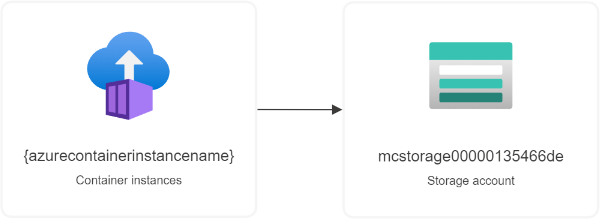

# Azure Resource Manager Templates

## Minecraft Server on Azure Container Instances

ARM Template to deploy a containerized Minecraft Server to Azure. The output will be:
- an **ACI** (Azure Container Instance) running the Minecraft Server image from [itzg/docker-minecraft-server](https://github.com/itzg/docker-minecraft-server);
- an Azure **Storage Account** with a *file share* to store the server data and progress.

